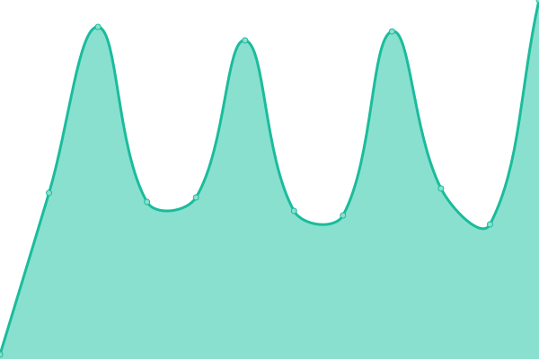

# [📈 Live Status](https://upptime.github.io/upptime): <!--live status--> **🟩 All systems operational**

This repository contains an open-source uptime monitor and status page for HRE applications, powered by [Upptime](https://github.com/upptime/upptime).

<!--start: status pages-->
<!-- This summary is generated by Upptime (https://github.com/upptime/upptime) -->
<!-- Do not edit this manually, your changes will be overwritten -->
<!-- prettier-ignore -->
| URL | Status | History | Response Time | Uptime |
| --- | ------ | ------- | ------------- | ------ |
|  [Canada Food Guide](https://food-guide.canada.ca/en) | 🟩 Up | [canada-food-guide.yml](https://github.com/10ego/HREup/commits/HEAD/history/canada-food-guide.yml) | 

 468ms
     
 | 

<a href="https://10ego.github.io/HREup/history/canada-food-guide">100.00%</a>
    

|  [Canada Vigilance Consumer Dashboard](https://health-products.canada.ca/adverse-reaction/) | 🟩 Up | [canada-vigilance-consumer-dashboard.yml](https://github.com/10ego/HREup/commits/HEAD/history/canada-vigilance-consumer-dashboard.yml) | 

 323ms
     
 | 

<a href="https://10ego.github.io/HREup/history/canada-vigilance-consumer-dashboard">100.00%</a>
    

|  [Canadian Nutrient File](https://health-products.canada.ca/cnf-fce/) | 🟩 Up | [canadian-nutrient-file.yml](https://github.com/10ego/HREup/commits/HEAD/history/canadian-nutrient-file.yml) | 

 419ms
     
 | 

<a href="https://10ego.github.io/HREup/history/canadian-nutrient-file">100.00%</a>
    

|  [Clinical Trials Search](https://health-products.canada.ca/ctdb-bdec/index-eng.jsp) | 🟩 Up | [clinical-trials-search.yml](https://github.com/10ego/HREup/commits/HEAD/history/clinical-trials-search.yml) | 

 123ms
     
 | 

<a href="https://10ego.github.io/HREup/history/clinical-trials-search">100.00%</a>
    

|  [Controlled Vocabulary](https://cv.hres.ca) | 🟩 Up | [controlled-vocabulary.yml](https://github.com/10ego/HREup/commits/HEAD/history/controlled-vocabulary.yml) | 

 746ms
     
 | 

<a href="https://10ego.github.io/HREup/history/controlled-vocabulary">100.00%</a>
    

|  [COVID Vaccine Portal](https://covid-vaccine.canada.ca) | 🟩 Up | [covid-vaccine-portal.yml](https://github.com/10ego/HREup/commits/HEAD/history/covid-vaccine-portal.yml) | 

 365ms
     
 | 

<a href="https://10ego.github.io/HREup/history/covid-vaccine-portal">100.00%</a>
    

|  [The Drug and Health Products Register](https://hpr-rps.hres.ca) | 🟩 Up | [the-drug-and-health-products-register.yml](https://github.com/10ego/HREup/commits/HEAD/history/the-drug-and-health-products-register.yml) | 

 323ms
     
 | 

<a href="https://10ego.github.io/HREup/history/the-drug-and-health-products-register">100.00%</a>
    

|  [Drug Products Database (DPD)](https://health-products.canada.ca/dpd-bdpp/) | 🟩 Up | [drug-products-database-dpd.yml](https://github.com/10ego/HREup/commits/HEAD/history/drug-products-database-dpd.yml) | 

 347ms
     
 | 

<a href="https://10ego.github.io/HREup/history/drug-products-database-dpd">100.00%</a>
    

|  [DPD API](https://health-products.canada.ca/api/drug/company/?lang=en&type=json) | 🟩 Up | [dpd-api.yml](https://github.com/10ego/HREup/commits/HEAD/history/dpd-api.yml) | 

 336ms
     
 | 

<a href="https://10ego.github.io/HREup/history/dpd-api">100.00%</a>
    

|  [eSAP prod](https://appian.hpfb-dgpsa.ca/suite/) | 🟩 Up | [e-sap-prod.yml](https://github.com/10ego/HREup/commits/HEAD/history/e-sap-prod.yml) | 

 1748ms
     
 | 

<a href="https://10ego.github.io/HREup/history/e-sap-prod">99.81%</a>
    

|  eSAP Stage | 🟩 Up | [e-sap-stage.yml](https://github.com/10ego/HREup/commits/HEAD/history/e-sap-stage.yml) | 

 312ms
     
 | 

<a href="https://10ego.github.io/HREup/history/e-sap-stage">99.79%</a>
    

|  [LNHPD search](https://health-products.canada.ca/lnhpd-bdpsnh/) | 🟩 Up | [lnhpd-search.yml](https://github.com/10ego/HREup/commits/HEAD/history/lnhpd-search.yml) | 

 98ms
     
 | 

<a href="https://10ego.github.io/HREup/history/lnhpd-search">100.00%</a>
    

|  [Medical Devices Active License Listing](https://health-products.canada.ca/mdall-limh/) | 🟩 Up | [medical-devices-active-license-listing.yml](https://github.com/10ego/HREup/commits/HEAD/history/medical-devices-active-license-listing.yml) | 

 70ms
     
 | 

<a href="https://10ego.github.io/HREup/history/medical-devices-active-license-listing">100.00%</a>
    

|  [Medical Devices Establishment License Listing](https://health-products.canada.ca/mdel-leim/) | 🟩 Up | [medical-devices-establishment-license-listing.yml](https://github.com/10ego/HREup/commits/HEAD/history/medical-devices-establishment-license-listing.yml) | 

 442ms
     
 | 

<a href="https://10ego.github.io/HREup/history/medical-devices-establishment-license-listing">100.00%</a>
    

|  [Notice of Compliance search](https://health-products.canada.ca/noc-ac/) | 🟩 Up | [notice-of-compliance-search.yml](https://github.com/10ego/HREup/commits/HEAD/history/notice-of-compliance-search.yml) | 

 162ms
     
 | 

<a href="https://10ego.github.io/HREup/history/notice-of-compliance-search">100.00%</a>
    

|  Product Monograph PDFs | 🟩 Up | [product-monograph-pd-fs.yml](https://github.com/10ego/HREup/commits/HEAD/history/product-monograph-pd-fs.yml) | 

 629ms
     
 | 

<a href="https://10ego.github.io/HREup/history/product-monograph-pd-fs">100.00%</a>
    

|  [Reference Listing of Accepted Construction Materials, Packaging Materials and Non-Food Chemical Products Database](https://fpia.hres.ca) | 🟩 Up | [reference-listing-of-accepted-construction-materials-packaging-materials-and-non-food-chemical-products-database.yml](https://github.com/10ego/HREup/commits/HEAD/history/reference-listing-of-accepted-construction-materials-packaging-materials-and-non-food-chemical-products-database.yml) | 

 753ms
     
 | 

<a href="https://10ego.github.io/HREup/history/reference-listing-of-accepted-construction-materials-packaging-materials-and-non-food-chemical-products-database">100.00%</a>
    

|  [Reference Listing of Accepted Construction Materials, Packaging Materials and Non-Food Chemical Products Database (Old)](https://food-nutrition.canada.ca/food-safety/referencelist/index-en.php) | 🟩 Up | [reference-listing-of-accepted-construction-materials-packaging-materials-and-non-food-chemical-products-database-old.yml](https://github.com/10ego/HREup/commits/HEAD/history/reference-listing-of-accepted-construction-materials-packaging-materials-and-non-food-chemical-products-database-old.yml) | 

 617ms
     
 | 

<a href="https://10ego.github.io/HREup/history/reference-listing-of-accepted-construction-materials-packaging-materials-and-non-food-chemical-products-database-old">100.00%</a>
    

|  Regulatory Content API | 🟩 Up | [regulatory-content-api.yml](https://github.com/10ego/HREup/commits/HEAD/history/regulatory-content-api.yml) | 

 277ms
     
 | 

<a href="https://10ego.github.io/HREup/history/regulatory-content-api">100.00%</a>
    

|  Regulatory Decision Summary Page | 🟩 Up | [regulatory-decision-summary-page.yml](https://github.com/10ego/HREup/commits/HEAD/history/regulatory-decision-summary-page.yml) | 

 234ms
     
 | 

<a href="https://10ego.github.io/HREup/history/regulatory-decision-summary-page">100.00%</a>
    

|  Regulatory Enrollment Program Page | 🟩 Up | [regulatory-enrollment-program-page.yml](https://github.com/10ego/HREup/commits/HEAD/history/regulatory-enrollment-program-page.yml) | 

 58ms
     
 | 

<a href="https://10ego.github.io/HREup/history/regulatory-enrollment-program-page">100.00%</a>
    

|  Rest MDS Authorized Devices IVDD | 🟩 Up | [rest-mds-authorized-devices-ivdd.yml](https://github.com/10ego/HREup/commits/HEAD/history/rest-mds-authorized-devices-ivdd.yml) | 

 508ms
     
 | 

<a href="https://10ego.github.io/HREup/history/rest-mds-authorized-devices-ivdd">100.00%</a>
    

|  [Tables MDS Auth IVDD (fr)](https://tables.hres.ca/mdiol/IVDD-auth/auth-ivdd-fr.html) | 🟩 Up | [tables-mds-auth-ivdd-fr.yml](https://github.com/10ego/HREup/commits/HEAD/history/tables-mds-auth-ivdd-fr.yml) | 

 318ms
     
 | 

<a href="https://10ego.github.io/HREup/history/tables-mds-auth-ivdd-fr">100.00%</a>
    

|  [Tables MDS Non IVDD (fr)](https://tables.hres.ca/mdiol/nonIVDD-auth/auth-nonivdd-fr.html) | 🟩 Up | [tables-mds-non-ivdd-fr.yml](https://github.com/10ego/HREup/commits/HEAD/history/tables-mds-non-ivdd-fr.yml) | 

 56ms
     
 | 

<a href="https://10ego.github.io/HREup/history/tables-mds-non-ivdd-fr">100.00%</a>
    

|  [Tables MDS Pending (fr)](https://tables.hres.ca/mdiol/pending-IVDD-auth/pending-appl-fr.html) | 🟩 Up | [tables-mds-pending-fr.yml](https://github.com/10ego/HREup/commits/HEAD/history/tables-mds-pending-fr.yml) | 

 56ms
     
 | 

<a href="https://10ego.github.io/HREup/history/tables-mds-pending-fr">100.00%</a>
    

|  [Veterinary Health Products - Notification Program](https://health-products.canada.ca/vhp-psa/en) | 🟩 Up | [veterinary-health-products-notification-program.yml](https://github.com/10ego/HREup/commits/HEAD/history/veterinary-health-products-notification-program.yml) | 

 58ms
     
 | 

<a href="https://10ego.github.io/HREup/history/veterinary-health-products-notification-program">100.00%</a>
    

<!--end: status pages-->

## 📄 License

- Powered by: [Upptime](https://github.com/upptime/upptime)
- Code: [MIT](./LICENSE) © [Upptime](https://upptime.js.org)
- Data in the `./history` directory: [Open Database License](https://opendatacommons.org/licenses/odbl/1-0/)
